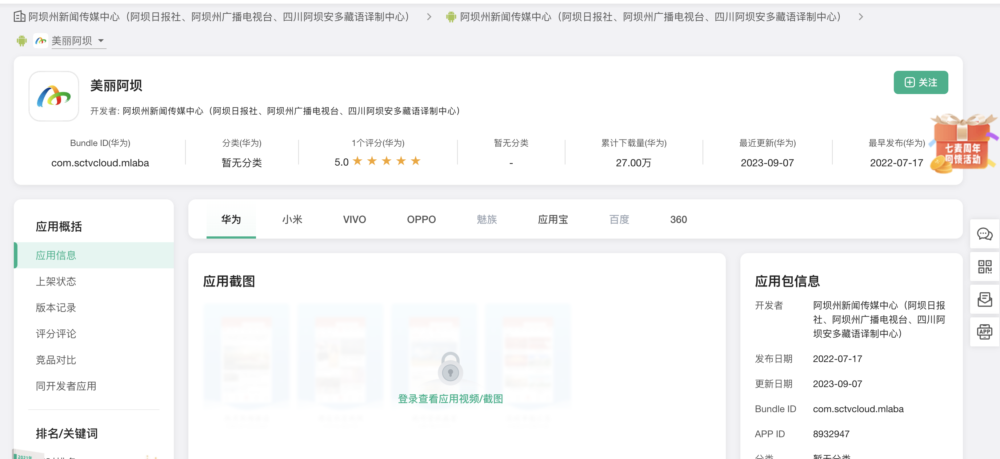
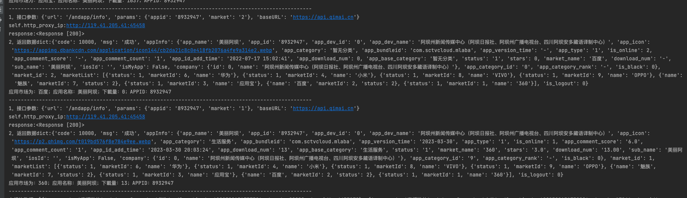
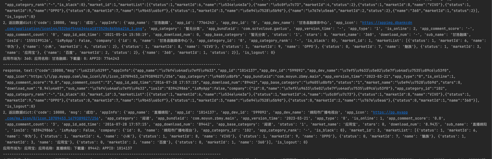

个人爬虫
===========================

### 七麦数据网 - https://www.qimai.cn

| Author | yxy1109           |
|--------|-------------------|
| Email  | 1049598673@qq.com |

****

## 声明

### 七麦数据(原ASO100)是七麦科技推出的国内专业的移动应用数据分析平台，是国内同时打通App数据、微信公众号数据、小程序数据的数据分析平台。<br>

### 软件均仅用于学习交流，请勿用于任何商业用途！感谢大家！

## 介绍

### 加密破解爬取七麦数据网应用下载量数据

- B站：https://www.bilibili.com/video/BV1q8411m7xq/
- B站作者是操作的排行榜，我操作的是app的下载量，加密方式是一样的，就是传入的参数不同而已
- QiMaiSpider.py：同步版本
- QiMaiSpider_coroutine.py：协程版本

## 运行环境

Version: Python3

## 安装依赖库

```
pip3 install -r requirements.txt
```

## **运行截图**

> - **查看APP下载量数据 - https://www.qimai.cn/andapp/baseinfo/appid/8932947/market/6 **<br><br>
    

> - **运行截图**<br><br>
    
    

## **总结**

> **最后，如果你觉得这个项目不错或者对你有帮助，给个Star呗，也算是对我学习路上的一种鼓励！<br>
哈哈哈，感谢大家！笔芯~**
